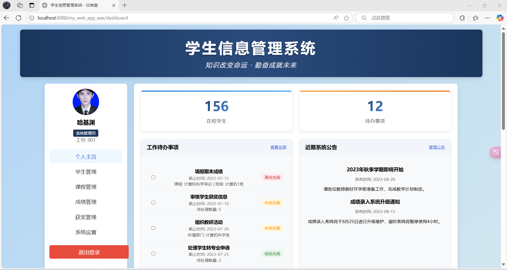
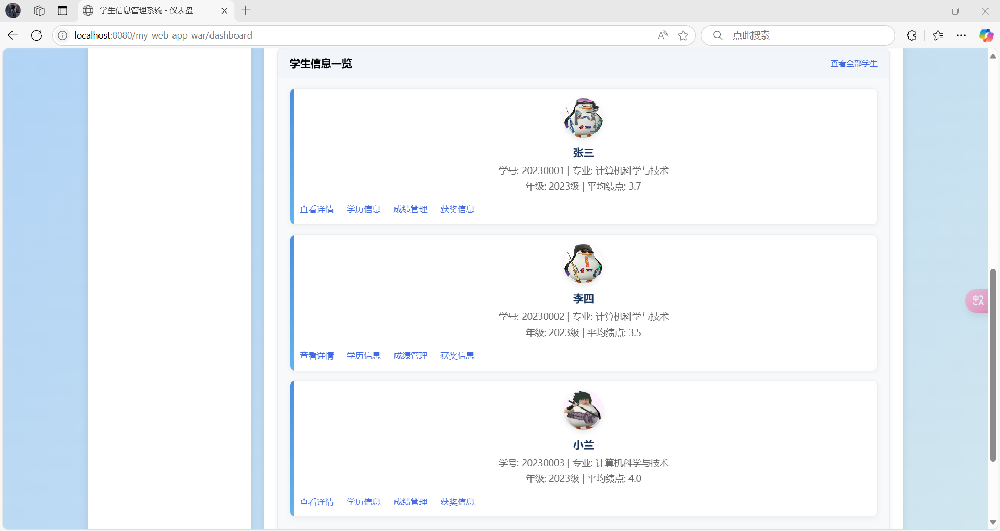
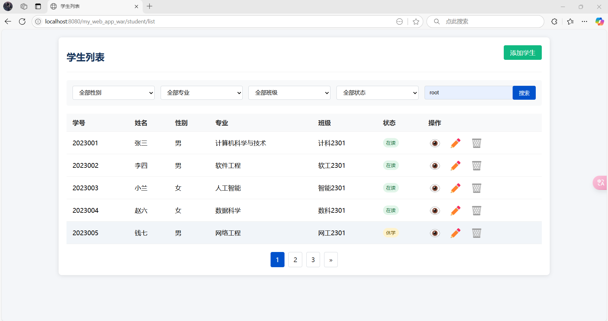
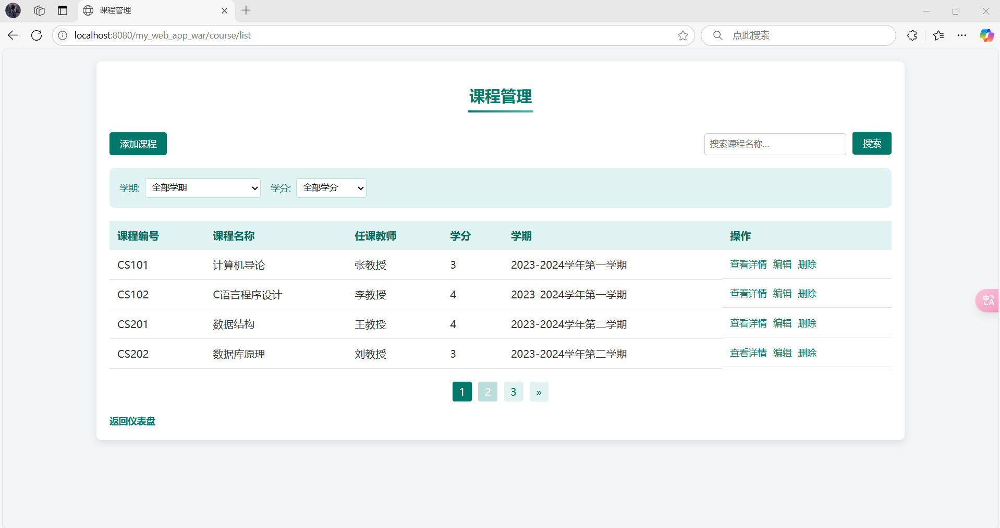

# 学生信息管理系统

在 `src/main/webapp/static/images` 目录下有以下截图文件（迭代历史）：
- src\main\webapp\static\images\11.png
- src\main\webapp\static\images\22.png
- src\main\webapp\static\images\33.png
- src\main\webapp\static\images\44.png


效果如下：






## 系统运行说明

### 环境准备
1. JDK 17+
2. Maven 3.6+
3. MySQL 8.0+
4. Tomcat 10.0+

### 数据库配置
1. 确保MySQL服务已启动
2. 执行初始化脚本：`init_database.bat`（Windows）
   - 该脚本会执行 `src/main/sql/stu.sql` 和 `src/main/sql/add_root_user.sql`
   - 会创建名为 "student_management" 的数据库并初始化表结构和数据
3. 数据库配置在 `src/main/resources/db.properties` 文件中

```properties
jdbc.driver=com.mysql.cj.jdbc.Driver
jdbc.url=jdbc:mysql://localhost:3306/student_management?useSSL=false&serverTimezone=UTC
jdbc.username=root
jdbc.password=zby2766485803
```

### 运行项目
1. 使用Maven构建项目：`mvn clean package`
2. 将生成的WAR包部署到Tomcat中
3. 访问: http://localhost:8080/my_web_app_war/

### 默认登录账户
- 用户名: root
- 密码: zby2766485803 (对应MD5值: e10adc3949ba59abbe56e057f20f883e)

## 系统功能
- 学生信息管理
- 课程管理
- 成绩管理
- 获奖信息管理

## 图片浏览
您可以通过访问 http://localhost:8080/my_web_app_war/images.jsp 来查看系统的所有截图。

## 测试页面
您可以通过访问 http://localhost:8080/my_web_app_war/test.jsp 来测试CSS样式是否正常加载。
